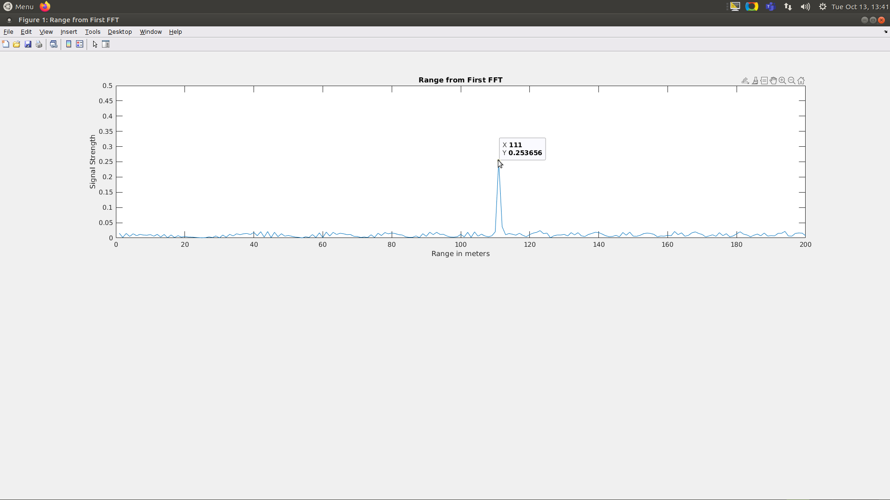
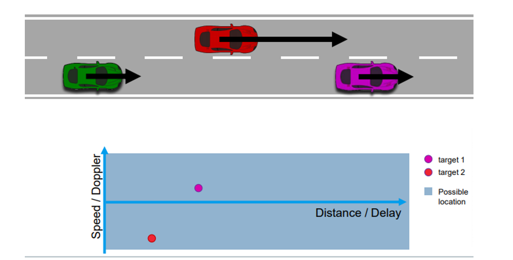
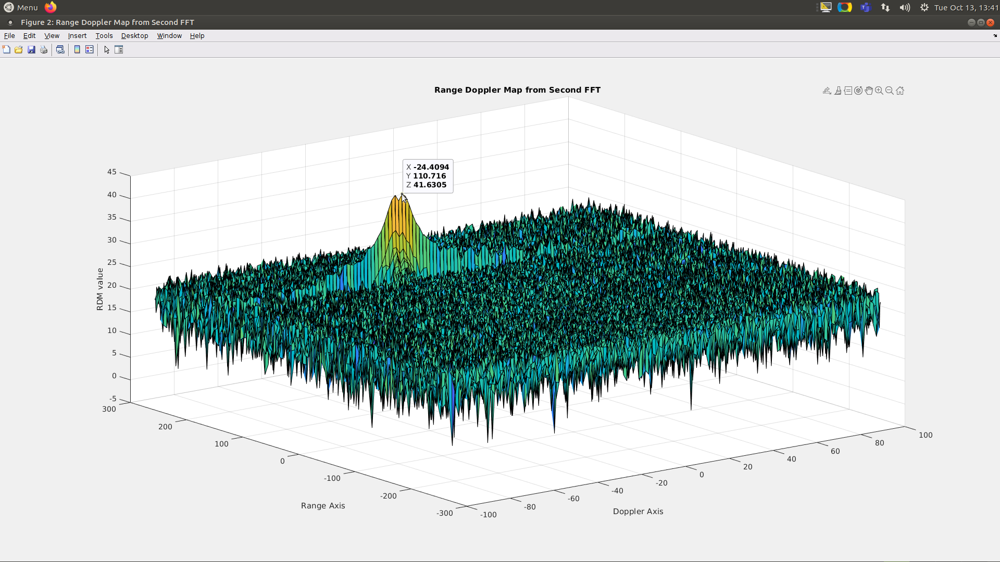
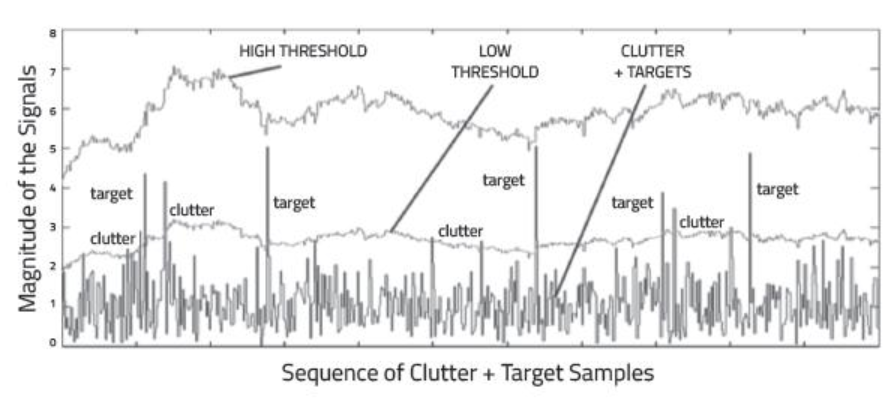
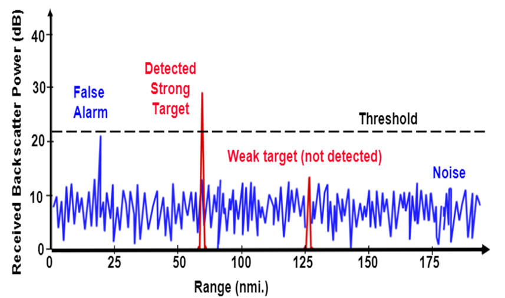
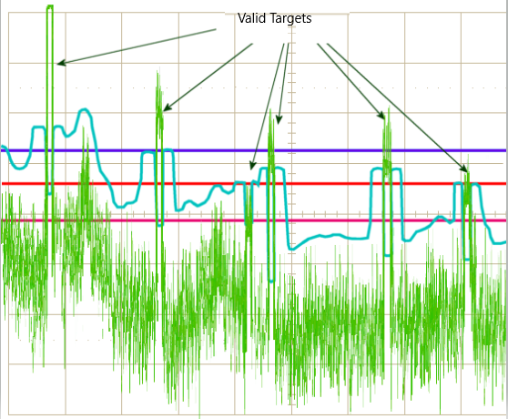
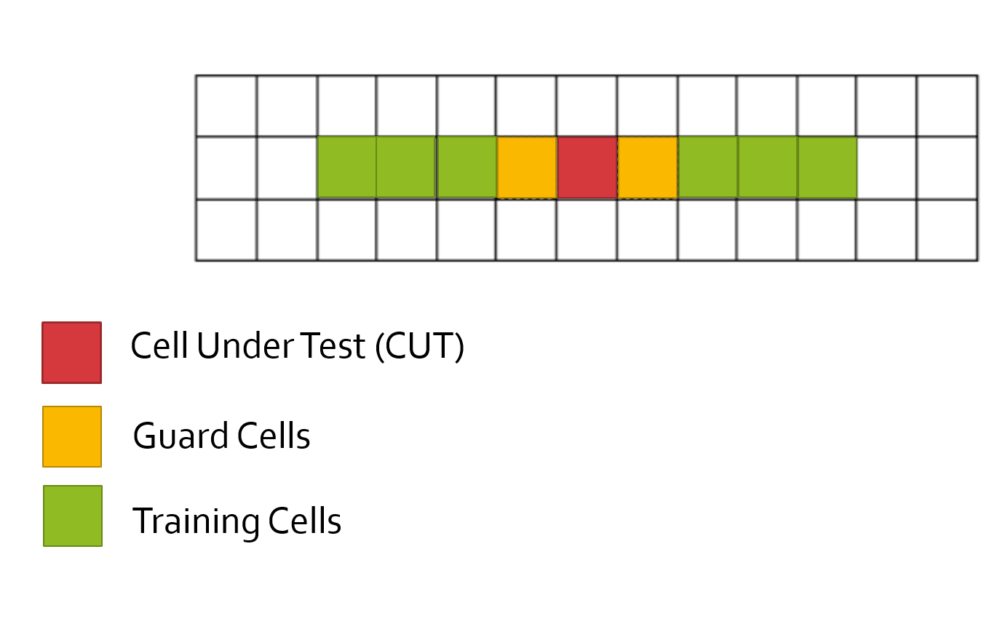
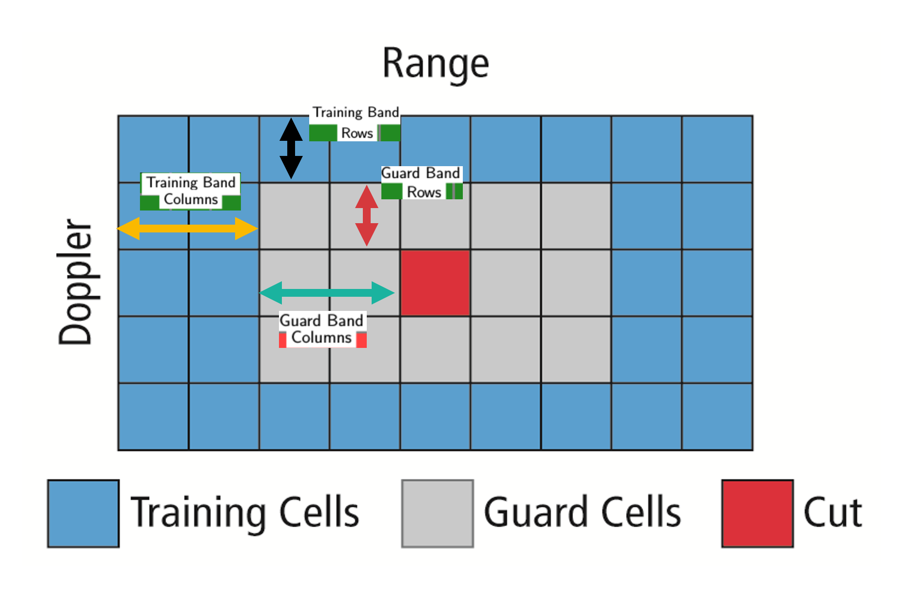
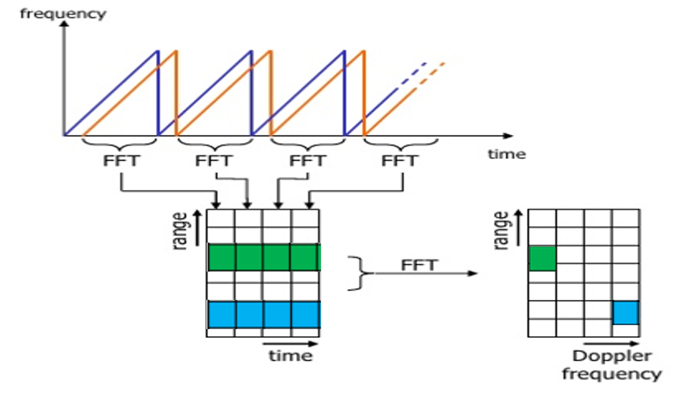
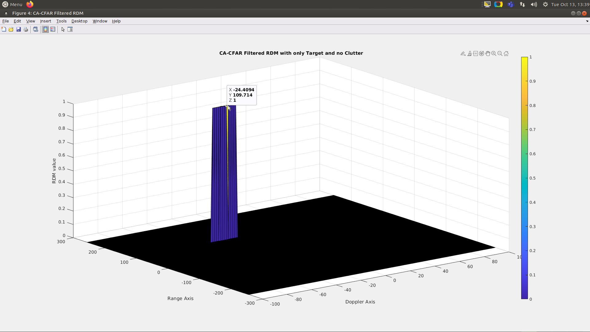

# SFND_Radar_Target_Generation_And_Detection

## Project's Rubric and FlowChart


### Designing FMCW waveform
* Radar Design Specifications : 
As different driving scenarios demand different sensor fusion approaches and hence which requires different Radar system configurations. In this project the provided Radar system requirements are mentioned below.


* Methodolgy : Max Range and Range Resolution are used to deduce 
   * Bandwidth(B sweep)=speedoflight/(2∗rangeResolution)
   * Also known as Sweep Time , T chirp =5.5⋅2⋅Rmax/c
   * Slope of a single chirp , Slope=Bandwidth/T chirp
   * Initial Range and velocity of the Target : Range cannot exceed the max value of 200m and velocity can be any value in the range of -70 to + 70 m/s.
​	

```Matlab
%% Radar Specifications 
%%%%%%%%%%%%%%%%%%%%%%%%%%%
% Frequency of operation = 77GHz
% Max Range = 200m
% Range Resolution = 1 m
% Max Velocity = 100 m/s
%%%%%%%%%%%%%%%%%%%%%%%%%%%

fc= 77e9;             %carrier freq
d_res = 1;
c = 3*10^8;
RMax = 200;

Bsweep = c/(2*d_res); %Bandwidth
Tchirp = 5.5*2*RMax/c; %chirp time
alpha = Bsweep/Tchirp; %slope of chirps
```
### Simulation Loop
Simulate Target movement and calculate the beat or mixed signal for every timestamp.

* Target Generation and Detection


```Matlab

d0 = 110;         %initial position 
v0 = -28;         %initial velocity 

Nd=128;          % total number of chirps
Nr=1024;         % total number of samples of one chirp

t=linspace(0,Nd*Tchirp,Nr*Nd); %total time for samples

Tx=zeros(1,length(t));         %Signal transmitted
Rx=zeros(1,length(t));         %Signal received
Mix = zeros(1,length(t));      %Mixing both the signals to get the Beat signal

r_t=zeros(1,length(t)); % vector for range covered 
td=zeros(1,length(t));  % vector for time delay

for i=1:length(t)         
    
    
    % *%TODO* :
    %For each time stamp update the Range of the Target for constant velocity. 
    r_t(i) = d0 + v0*t(i);
    td(i) = 2*r_t(i)/c; 
    % *%TODO* :
    %For each time sample we need update the transmitted and
    %received signal. 
    Tx(i) = cos(2*pi*(fc*t(i) + slope*t(i)^2/2));
    Rx(i) = cos(2*pi*(fc*(t(i) - td(i)) + slope*(t(i) - td(i))^2/2));
    % *%TODO* :
    %Now by mixing the Transmit and Receive generate the beat signal
    %This is done by element wise matrix multiplication of Transmit and
    %Receiver Signal
    Mix(i) = Tx(i) * Rx(i);
    
end

```

### Range FFT (1st FFT)
Implement the Range FFT on the Beat or Mixed Signal and plot the result.
Steps Involved: 
* Implemented the 1D FFT on the Mixed Signal
* Reshaped the vector into Nr*Nd array.
* Ran the FFT on the beat signal along the range bins  dimension (Nr)
* Normalized the FFT output.
* Took the absolute value of that output.
* Kept one half of the signal
* Ploted the output
* There is a peak at the initial position of the target mentioned below


```Matlab
%% RANGE MEASUREMENT


 % *%TODO* :
%reshape the vector into Nr*Nd array. Nr and Nd here would also define the size of
%Range and Doppler FFT respectively.
Mix = reshape(Mix,[Nr,Nd]);
 % *%TODO* :
%run the FFT on the beat signal along the range bins dimension (Nr) and
%normalize.
sig_fft1 = fft(Mix,Nr);  
sig_fft1 = sig_fft1./Nr;
 % *%TODO* :
% Take the absolute value of FFT output
sig_fft1 = abs(sig_fft1);  
 % *%TODO* :
% Output of FFT is double sided signal, but we are interested in only one side of the spectrum.
% Hence we throw out half of the samples.
single_side_sig_fft1 = sig_fft1(1:Nr/2);

%plotting the range
figure1 = figure ('Name','Range from First FFT');
subplot(2,1,1)

 % *%TODO* :
 % plot FFT output 
plot(single_side_sig_fft1); 
title('Range from First FFT')
xlabel('Range in meters') 
ylabel('Signal Strength') 
xticks(0:20:200);
yticks(0:0.05:0.5);
axis ([0 200 0 0.5]);

saveas(figure1, 'Output_Images/Range_First_FFT.png')

```

### Doppler FFT (2nd FFT)
The 2nd FFT is already implemented in the code. It  generates a Range Doppler Map as seen in the image below and it will be given by variable ‘RDM’.



This is how the RDM with heatmap looks for real life data. Horizontal axis is Range which is directly related to the power of the Rx signal received(Used for color coding). Vertical axis is the velocity which is centered at 0 and on the left with negative axis targets are approaching, wheras positive sides means receding targets.(As pink car is approaching tharget as  speed is less, Red car is faster than the green car/ego car and is therefore receding).


2D FFT response showing only one target for the assignment's RDM along with clutter noise all around.

```Matlab
%% RANGE DOPPLER RESPONSE
% The 2D FFT implementation is already provided here. This will run a 2DFFT
% on the mixed signal (beat signal) output and generate a range doppler
% map.You will implement CFAR on the generated RDM


% Range Doppler Map Generation.

% The output of the 2D FFT is an image that has reponse in the range and
% doppler FFT bins. So, it is important to convert the axis from bin sizes
% to range and doppler based on their Max values.

Mix=reshape(Mix,[Nr,Nd]);

% 2D FFT using the FFT size for both dimensions.
sig_fft2 = fft2(Mix,Nr,Nd);

% Taking just one side of signal from Range dimension.
sig_fft2 = sig_fft2(1:Nr/2,1:Nd);
sig_fft2 = fftshift (sig_fft2);
RDM = abs(sig_fft2);
RDM = 10*log10(RDM) ;

%use the surf function to plot the output of 2DFFT and to show axis in both
%dimensions
doppler_axis = linspace(-100,100,Nd);
range_axis = linspace(-200,200,Nr/2)*((Nr/2)/400);
figure2 = figure('Name','Range Doppler Map from Second FFT');
surf(doppler_axis,range_axis,RDM);
title('Range Doppler Map from Second FFT')
xlabel('Doppler Axis') 
ylabel('Range Axis')
zlabel('RDM value') 
saveas(figure2, 'Output_Images/Range_Doppler_MAP_Second_FFT.png')

```
### 2D CFAR Implementation
* Implement the 2D CFAR process on the output of 2D FFT  operation, i.e the Range Doppler Map(output from 2nd FFT of the Mix/Beat Signal).

* Steps involved:
  * Determine the number of Training cells for each dimension. Similarly, pick the number of guard cells.
  * Slide the cell under test across the complete matrix. Make sure the CUT has margin for Training and Guard cells from the edges.
  * For every iteration sum the signal level within all the training cells. To sum convert the value from logarithmic to linear using db2pow function.
  * Average the summed values for all of the training cells used. After averaging convert it back to logarithmic using pow2db.
  * Further add the offset to it to determine the threshold.
  * Next, compare the signal under CUT against this threshold.
  * If the CUT level > threshold assign it a value of 1, else equate it to 0.

     


How clutter noise and simple fixed thresholding can lead to miss detections of week targets or can lead to clutter being detected as false targets.
 



To tackle the above issue a constant flexible false alarm rate is implemented. The CFAR used here is CA_CFAR(Cell averaging for noise in order to decide a dynamic/adaptive threshold based on the surrondings of the CUT(Cell under test of the sliding grid)). Here Sky green/light blue curve is the dynamic threshold acheived by CFAR technique and all the other straight lines are fixes thresholds for comparison.


1D CFAR(Note For Dense Traffic Scenarios Number of training cells should be less as nearby targets can interfere the test cell readings of the target under test)

* CA-CFAR is the most commonly used CFAR detection technique. As seen in the previous lesson, the FFT blocks are generated on implementing range and doppler FFTs across the number of chirps. The CFAR process includes the sliding of a window across the cells in FFT blocks. Each window consists of the following cells.

    * Cell Under Test : The cell that is tested to detect the presence of the target by comparing the signal level against the noise estimate (threshold).

    * Training Cells : The level of noise is measured over the Training Cells. The Training Cells can be divided into two regions, the cells lagging the CUT, called lagging Training Cells and the cells leading the CUT, called Leading Training Cells. The noise is estimated by averaging the noise under the training cells. In some cases either leading or lagging cell average is taken, while in the other the leading and lagging cell average is combined and the higher of two is considered for noise level estimate.The number of training cells should be decided based on the environment. If a dense traffic scenario then the fewer training cells should be used, as closely spaced targets can impact the noise estimate.

    * Guard Cells : The cells just next to CUT are assigned as Guard Cells. The purpose of the Guard Cells is to avoid the target signal from leaking into the training cells that could adversely affect the noise estimate. The number of guard cells should be decided based on the leakage of the target signal out of the cell under test. If target reflections are strong they often get into surrounding bins.

    * Threshold Factor (Offset) : Use an offset value to scale the noise threshold. If the signal strength is defined in logarithmic form then add this offset value to the average noise estimate, else multiply it.

2D CFAR(Note For Dense Traffic Scenarios Nunber of columns and rows of the training cells should be less as nearby targets can interfere the test cell readings of the target under test)




In a RDM(Range Doppler Map) as it is stored in the form of Matrix where the index number of Row represents the Range of the targets in the measurement space and the number index of the column displays the velocity or the Doppler frequency of the target so more the index of Row, further away is the target and more the index of the column, faster is the travelling rate of the target.

  * First FFT gives the Range component and second FFT gives the doppler/velocity component of the signal received.



After CA-CFAR 2D filtering only the target is displayed in the RDM rest all is zeroed out.

* The process above will generate a thresholded block, which is smaller than the Range Doppler Map as the CUTs cannot be located at the edges of the matrix due to the presence of Target and Guard cells. Hence, those cells will not be thresholded.

  * To keep the map size same as it was before CFAR, equate all the non-thresholded cells to 0.

```Matlab
%% CFAR implementation

%Sliding Window comprising of CUT,Guard Cells and Training Cells through the complete Range Doppler Map

% *%TODO* :
%Configuring the sliding window dimensions
%Select the number of Training Cells in both dimensions Tcr:Row and Tcd:Colums
Tcr = 9;
Tcd = 8;
% *%TODO* :
%Select the number of Guard Cells in both dimensions Gcr:Row and Gcd:Colums around the Cell under 
%test (CUT) for accurate estimation
Gcr = 5;
Gcd = 5;
% *%TODO* :
% offset the threshold by SNR value in dB
offset = 1.4;

% *%TODO* :

%design a loop such that it slides the CUT across range doppler map by
%giving margins at the edges for Training and Guard Cells.
%For every iteration sum the signal level within all the training
%cells. To sum convert the value from logarithmic to linear using db2pow
%function. Average the summed values for all of the training
%cells used. After averaging convert it back to logarithimic using pow2db.
%Further add the offset to it to determine the threshold. Next, compare the
%signal under CUT with this threshold. If the CUT level > threshold assign
%it a value of 1, else equate it to 0.


% Use RDM[x,y] as the matrix from the output of 2D FFT for implementing
% CFAR


%Normalising the RDM Matrix
RDM = RDM/max(max(RDM));

% The row number of the CUT(Cell under test) will vary from Tcr+Gcr+1(Training band rows + Guard band rows + 1) as First CUT will be located in this row
% It will go till (Nr/2)-(Gcr+Tcr); subtracting by Nr/2 as the that is the last rows number in the RDM matrix
% Because while Taking just one side of signal from Range dimension. FFT2 was calculated for half of the sample (Positive returns) 
% sig_fft2 = sig_fft2(1:Nr/2,1:Nd)
for i = Tcr+Gcr+1:(Nr/2)-(Gcr+Tcr)
    % Similarly column number of the CUT cell will vary from Tcd+Gcd+1(Training band columns + Guard band columns + 1) as first column 
    % It will go till Nd-(Gcd+Tcd); subtracting by Nd(Number of chirps in the signal Mixed signal) as that is the last column number in the RDM matrix
    for j = Tcd+Gcd+1:Nd-(Gcd+Tcd)
        
       % Vector to store noise_level for each iteration on training cells
        noise_level = zeros(1,1);
        
        % Calculate noise SUM in the area around CUT excluding the Guard cells area 
        
        % while calculating the noise iterating is done from the left extreme end: i-(Tcr+Gcr) to the right extreme end: i+(Tcr+Gcr) of the sliding window 
        % surrounding the current CUT in consideration: i
        for p = i-(Tcr+Gcr) : i+(Tcr+Gcr)
            for q = j-(Tcd+Gcd) : j+(Tcd+Gcd)
                % Excluding the cells lying in the Guard cells area of the sliding window 
                if (abs(i-p) > Gcr || abs(j-q) > Gcd)
                    % converting the RDM value back to db as earlier it was stored as power of the signal using
                    % RDM = 10*log10(RDM) above while collecting the RDM using 2nd FFT
                    noise_level = noise_level + db2pow(RDM(p,q));
                end
            end
        end
        
        % Convert the averaged noise for the RDM above to db so that;  offset in dbs can directly be added and Adaptive threshold could 
        % calculated for the particular sliding window position in the RDM 
        threshold = pow2db(noise_level/(2*(Tcd+Gcd+1)*2*(Tcr+Gcr+1)-(Gcr*Gcd)-1));
        threshold = threshold + offset;
        CUT = RDM(i,j);
        
        if (CUT < threshold)
            RDM(i,j) = 0;
        else
            RDM(i,j) = 1;
        end
    end
end 

% *%TODO* :
% The process above will generate a thresholded block, which is smaller 
%than the Range Doppler Map as the CUT cannot be located at the edges of
%matrix. Hence,few cells will not be thresholded. To keep the map size same
% set those values to 0. 
RDM(union(1:(Tcr+Gcr),end-(Tcr+Gcr-1):end),:) = 0;  % Rows
RDM(:,union(1:(Tcd+Gcd),end-(Tcd+Gcd-1):end)) = 0;  % Columns 


% *%TODO* :
%display the CFAR output using the Surf function like we did for Range
%Doppler Response output.
figure3 = figure('Name','CA-CFAR Filtered RDM');
surf(doppler_axis,range_axis,RDM);
colorbar;
title('CA-CFAR Filtered RDM with only Target and no Clutter')
xlabel('Doppler Axis') 
ylabel('Range Axis')
zlabel('RDM value') 
saveas(figure3, 'Output_Images/CA-CFAR_Filtered_RDM.png')

```

